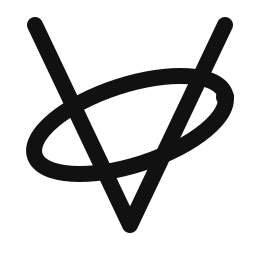

<p align="center">
  <picture>
    <source media="(prefers-color-scheme: dark)">
    
  </picture>
</p>


<h3 align="center">Vora — a dynamically typed scripting language.</h3>

<p align="center">
  <strong>JavaScript-like syntax. Lua-level simplicity. Wren-style object orientation.</strong>
</p>

<p align="center">
  <a href="https://github.com/Vora-lang/Vora/releases"></a>
  <a href="https://github.com/Vora-lang/Vora/actions"></a>
  <a href="https://github.com/Vora-lang/Vora/blob/main/LICENSE"></a>
  <a href="https://github.com/Vora-lang/Vora-LSP"></a>
  <a href="https://github.com/Vora-lang/Vora-LSP"></a>
</p>

---

## Quick look

```vora
// Objects with inheritance
Obj Animal(name) {
    this.name = name
    this.speak() {
        print(this.name + " makes a sound")
    }
}

Obj Dog(breed) : Animal(breed) {
    this.speak() {
        print(this.name + " barks!")
    }
}

let dog = Dog("Buddy")
dog.speak()  // → "Buddy barks!"

// Closures & higher-order functions
func makeCounter(start) {
    func increment() {
        start = start + 1
        return start
    }
    return increment
}

let counter = makeCounter(0)
print(counter())  // → 1
print(counter())  // → 2

// Pattern matching
let result = match [200, "OK"] {
    [200, let msg] => "Success: " + msg,
    [404, _] => "Not found",
    else => "Unknown"
}
// → "Success: OK"

// List comprehensions & generators
let squares = [x * x for x in 1..5]  // → [1, 4, 9, 16, 25]

func gen* fib() {
    let a = 0, b = 1
    while (true) {
        yield a
        let t = a; a = b; b = t + b
    }
}
```

## Features

| Category | What's inside |
|----------|--------------|
| **Types** | Null, Bool, Int, Float, String, Array, Dict, Set, Map, Function, Object |
| **Control flow** | `if/else`, `while`, `for` (C-style), `for-in`, `match`, `break`/`continue` |
| **Functions** | Closures, default params, rest params, named params, destructuring, TCO, lambdas |
| **Objects** | Single + multiple inheritance (C3 linearization), `super`, static methods |
| **Error handling** | `try/catch/finally`, error call-stack traces |
| **Modules** | `import`/`export`, relative + stdlib resolution, circular import detection |
| **Operators** | `?.` optional chaining, `??` nullish coalescing, `**` exponentiation, `++`/`--` |
| **Iterators** | `iter()`/`next()` protocol, generators (`yield`), `StopIteration` |
| **Tooling** | REPL, bytecode VM, `vora fmt`, LSP server, DAP debugger |
| **Performance** | NaN-boxed 8-byte Value, superinstructions, constant folding, tail-call optimization |

## Install

```bash
# Windows (MSI installer with PATH + VORA_STD_PATH)
winget install Vora-lang.Vora

# macOS
brew install vora-lang/vora/vora

# Linux (.deb / .rpm / .pkg.tar.xz)
# Download from the latest GitHub release
```

```bash
vora hello.va    # run a script
vora --repl      # interactive REPL
vora fmt -w file.va  # format source
```

## Repositories

| | |
|-----|-----|
| [**Vora**](https://github.com/Vora-lang/Vora) | Language core — lexer, parser, AST, bytecode compiler, VM, stdlib |
| [**Vora-LSP**](https://github.com/Vora-lang/Vora-LSP) | LSP server (C++) + VS Code extension + DAP debug adapter |
| [**Vora-WASM**](https://github.com/Vora-lang/Vora-WASM) | Browser runtime via Emscripten + JavaScript bridge |
| [**Vora-lang.github.io**](https://github.com/Vora-lang/Vora-lang.github.io) | Generated user documentation site |

## Editor support

- **VS Code** — [vora-lang](https://marketplace.visualstudio.com/items?itemName=Vora-lang.vora-lang) extension (syntax highlighting + LSP + debugger)
- **Zed** — [tree-sitter-vora](https://github.com/Vora-lang/Vora-LSP/tree/main/syntaxes) grammar

---

<p align="center">
  <sub>Built with ❤️ in C++17. Zero external dependencies.</sub>
</p>
